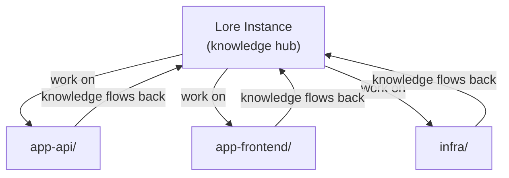

# Working Across Repos

Lore is a knowledge hub — one project that tracks and performs work across all your other repositories. Your work repos stay clean. Knowledge compounds here.

## Why a Central Hub

Without a central project, you have two options — both worse:

1. **Agent files in every repo** — knowledge fragments. The same gotcha gets rediscovered per-repo. No cross-project context. Work repos get cluttered with skills, docs, and hooks that have nothing to do with the application.
2. **No persistent knowledge** — the agent starts cold every session. No skills, no context docs, no work tracking.

A single Lore project avoids both. Knowledge compounds in one place, work repos stay clean, and cross-project context builds naturally.

## How It Works



1. **Connect your agent to the Lore instance.** CLI agents launch from here directly. IDE agents use `/lore-link` to work from the code repo with hooks firing from the hub.

2. **Work on other repos.** The agent reads, writes, and runs commands across repos using absolute paths.

3. **Knowledge captures back to Lore.** Gotchas become skills, endpoints go to context docs, multi-step procedures become runbooks — all stored here, available next session.

## What Stays in Lore

| Artifact | Example |
|----------|---------|
| **Skills** | "This API requires case-sensitive org names" |
| **Context docs** | Repo inventory, service endpoints, relationships |
| **Runbooks** | "How to deploy app-api to staging" |
| **Work items** | Roadmaps and plans that span multiple repos |

None of this pollutes your work repos.

## Two Workflows

There are two equally valid ways to work with Lore, depending on your agent and tooling.

**CLI agents (Claude Code, OpenCode):** Launch from the Lore instance. This loads instructions, hooks, and accumulated knowledge. Then reference any other repo by path.

```bash
cd ~/projects/my-lore-project
claude       # Claude Code
opencode     # OpenCode
```

**IDE agents (Cursor, IDE-mode Claude Code):** Use `/lore-link` to work from your code repo. You keep full file tree, git integration, and search — hooks still fire from the hub.

## IDE Workflow: lore-link

For CLI agents, launching from the hub is straightforward. For IDEs like Cursor, it means losing the work repo's file tree, git integration, and search.

`/lore-link` resolves this. Run it once from the hub and it generates lightweight configs in the work repo that point hooks back to the hub via `LORE_HUB`. You open the work repo in your IDE with full navigation — and hooks still fire from the hub.

### Usage

```
/lore-link ~/projects/my-app          # Link a work repo
/lore-link --unlink ~/projects/my-app  # Remove the link
/lore-link --list                       # Show linked repos (with stale detection)
/lore-link --refresh                    # Regenerate configs in all linked repos
```

### What It Generates

In the target repo, `/lore-link` creates:

- **Claude Code** — `.claude/settings.json` with hooks pointing to the hub
- **Cursor** — `.cursor/hooks.json` + `.cursor/mcp.json` + `.cursor/rules/lore-*.mdc` pointing to the hub
- **OpenCode** — `.opencode/plugins/` wrappers + `.opencode/commands/` + `opencode.json` pointing to the hub
- **Instructions** — `CLAUDE.md` rewritten from hub's `.lore/instructions.md`

All generated files are added to the target repo's `.gitignore` automatically.

### When to Use Which

| Scenario | Approach |
|----------|----------|
| CLI agent (Claude Code, OpenCode) | Launch from the Lore instance |
| IDE agent (Cursor, or IDE-mode Claude Code) | `/lore-link` — link the work repo, open it in your IDE |
| Quick cross-repo task from the hub | Launch from the Lore instance, reference the path |

### After Framework Updates

Run `/lore-link --refresh` after `/lore-update` to regenerate configs in all linked repos with the latest hooks.

## Framework Updates

The Lore framework (hooks, scripts, built-in skills) updates separately from your knowledge. Run `/lore-update` to pull the latest framework files. Your docs, agents, and work items are never touched.
