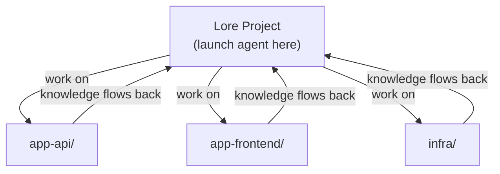

# Working Across Repos

Lore is a knowledge hub — one project that tracks and performs work across all your other repositories. Your work repos stay clean. Knowledge compounds here.

## Why a Central Hub

Without a central project, you have two options — both worse:

1. **Agent files in every repo** — knowledge fragments. The same gotcha gets rediscovered per-repo. No cross-project context. Work repos get cluttered with skills, docs, and hooks that have nothing to do with the application.
2. **No persistent knowledge** — the agent starts cold every session. No skills, no context docs, no work tracking.

A single Lore project avoids both. Knowledge compounds in one place, work repos stay clean, and cross-project context builds naturally.

## How It Works

1. **Launch your agent from the Lore project.** This loads hooks, skills, and context — everything the agent needs to operate with persistent memory.

2. **Tell it to work on other repos.** The agent reads, writes, and runs commands across repos using absolute paths.

3. **Knowledge captures back to Lore.** Gotchas become skills, endpoints go to context docs, multi-step procedures become runbooks — all stored here, available next session.

## What Stays in Lore

| Artifact | Example |
|----------|---------|
| **Skills** | "This API requires case-sensitive org names" |
| **Context docs** | Repo inventory, service endpoints, relationships |
| **Runbooks** | "How to deploy app-api to staging" |
| **Work items** | Roadmaps and plans that span multiple repos |

None of this pollutes your work repos.

## The One Rule

**Always launch your agent from the Lore project directory.** That's what loads the operating principles, hooks, and accumulated knowledge. If you launch from a work repo instead, the agent starts without context.

## Framework Updates

The Lore framework (hooks, scripts, built-in skills) updates separately from your knowledge. Run `/lore-update` to pull the latest framework files. Your docs, agents, and work items are never touched.
