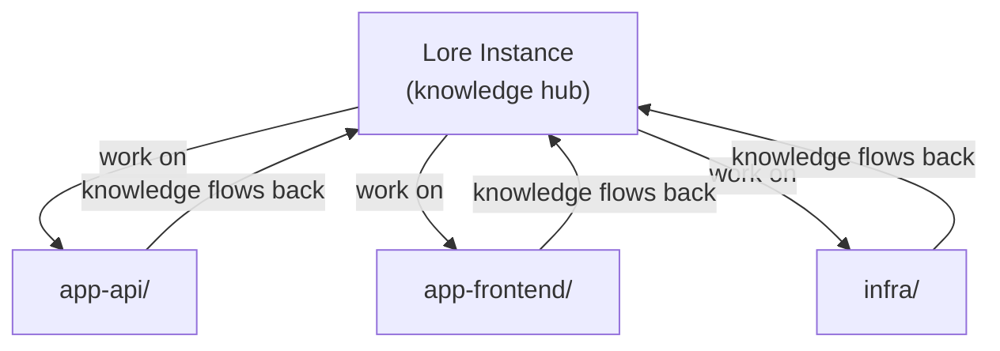

# Working Across Repos

Lore is a knowledge hub — one project that tracks and performs work across all your other repositories. Work repos stay clean. Knowledge compounds here.

## How It Works

```mermaid
flowchart TD
    Lore["Lore Instance<br/>(knowledge hub)"]
    Lore -->|work on| A["app-api/"]
    Lore -->|work on| B["app-frontend/"]
    Lore -->|work on| C["infra/"]

    A -->|knowledge flows back| Lore
    B -->|knowledge flows back| Lore
    C -->|knowledge flows back| Lore
```

1. **Connect** — CLI agents launch from here. IDE agents use `/lore-link` to work from the code repo with hooks firing from the hub.
2. **Work** — the agent reads, writes, and runs commands across repos using absolute paths.
3. **Capture** — gotchas become skills, endpoints become context docs, procedures become runbooks — all stored here.

## Two Workflows

**CLI agents (Claude Code, OpenCode):** Launch from the Lore instance, reference other repos by path.

**IDE agents (Cursor):** Tell your agent to link the work repo — it generates configs that point hooks back to the hub. You keep full file tree and git integration.

## What Stays in Lore

| Artifact | Example |
|----------|---------|
| **Skills** | "This API requires case-sensitive org names" |
| **Context docs** | Repo inventory, service endpoints, relationships |
| **Runbooks** | "How to deploy app-api to staging" |
| **Work items** | Roadmaps and plans that span multiple repos |

For full documentation, see [Working Across Repos](https://lorehq.github.io/lore-docs/guides/working-across-repos/) on the docs site.
